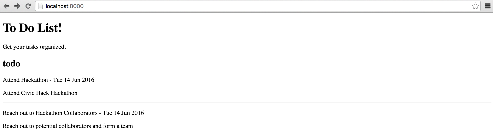
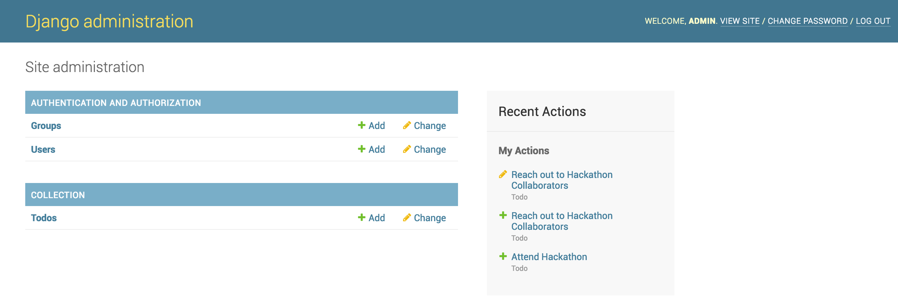

<h1> django-todo</h1>
Very simple TODO list web app.

### Initial Setup ###
1. Make a new virtualenv: ``virtualenv env``
2. Activate the virtualenv: ``source env/bin/activate``
3. Install Django: ``pip install -r requirements.txt``
4. Run the server: ``python manage.py runserver``
5. Open website in browser at ``http://localhost:8000``

### Basic usage examples ###
1. Activate the virtualenv: ``source env/bin/activate``
2. Run the server: ``python manage.py runserver``
3. Open website in browser at ``http://localhost:8000``

### Supported python versions ###
Tested on Python 2x and 3x version lines with Django 1.9.6

### Technologies Stack ###
* Python
* Django
* SQLite
* HTML
* CSS

### Home Page ###
* Displays TODO list

### Admin page ###
* Logged in user can add new tasks to the TODO list

### Admin mode ###
1. Create superuser (for admin site usage): ``python manage.py createsuperuser``
2. Open website in browser at ``http://localhost:8000/admin`` (enter your created before credentials) and add todos.

### Clear/Flush DB ###
1. Delete SQLite database: ``rm db.sqlite3``
2. Launch the migration: ``python manage.py migrate``

### License ###
**MIT** licensed library. See [LICENSE.txt](LICENSE.txt) for details.

### Contributing ###
If you have suggestions for improving the django-todo, please [open an issue or
pull request on GitHub](https://github.com/duboviy/web/).

### Badges ###

  

   

